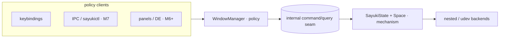
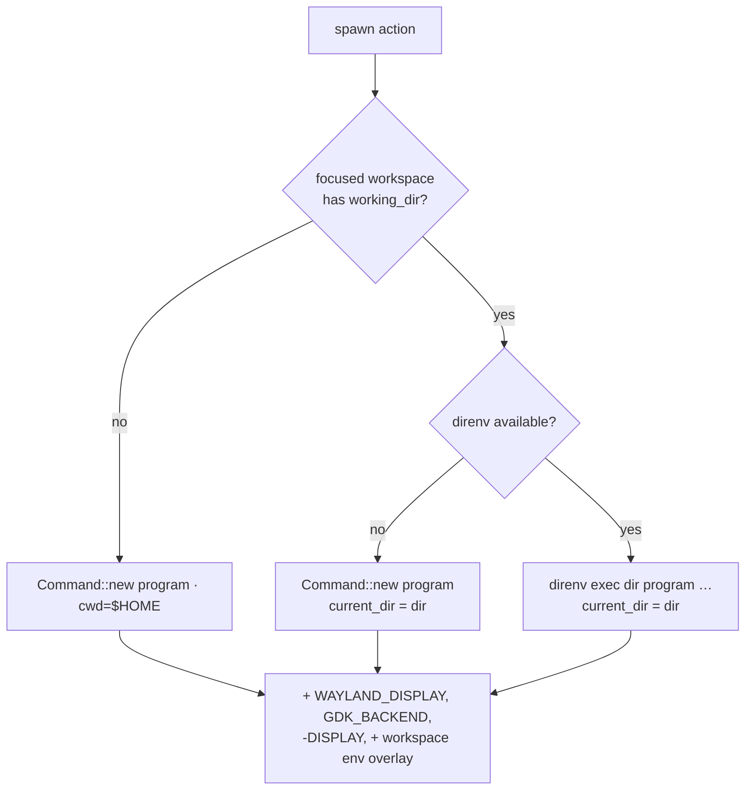

# Milestone 5 — Window Manager Model

Detailed spec for roadmap milestone 5 (`docs/roadmap.md`). Moves Sayuki from
example-compositor behavior to its own policy, oriented around **projects**:
a workspace is not a numeric slot but a project context that carries a working
directory, an environment (via direnv), and a desktop session (apps, layout,
window rules).

Status: planned. Split into **5a (WM core / mechanism)** and **5b (project
session layer / policy)**. 5a ships first and stands alone; 5b builds on it.

## Guiding principle: mechanism core, policy outside, IPC seam between

Sayuki aims to grow into a full desktop environment. The single rule that keeps
that scope survivable without core rewrites:

- **Core** (`state.rs`, backends, `Space`): surfaces, outputs, input, rendering.
  Knows nothing about projects or workspaces beyond mapping/unmapping elements.
- **Policy** (new `wm` module → future `sayuki-wm`): workspaces, focus, projects,
  hooks, layout, rules.
- **Seam**: an internal command/query interface the policy uses to drive the
  core. Milestone 7's IPC later exposes this same seam verbatim, so a panel, a
  `sayukictl`, or a project switcher become *more clients of the same interface*
  rather than reasons to change the core.



Non-goal for this milestone: any OS-level abstraction. The mechanism/policy/IPC
split keeps that direction *possible*; we do not pay for it now.

## Baseline (what exists today)

Grounded in `crates/sayuki-compositor/src`:

- `SayukiState` owns `space: Space<Window>` and a flat `windows: Vec<Window>`
  (`state.rs:66,68`). `Space` is the render/hit-test/output truth.
- New toplevels: `add_toplevel` (`state.rs:327`) pushes to `windows`;
  `handle_surface_commit` (`state.rs:357`) calls `place_window` (`state.rs:339`)
  on first buffered commit, staggering onto the **primary** output via
  `primary_output_geometry` (`state.rs:320`).
- Focus is derived from Smithay keyboard focus: `focused_window` (`state.rs:592`),
  set on click in `focus_window_at` (`state.rs:660`), which also
  `space.raise_element`s.
- `SwitchWorkspace(u8)` is parsed end-to-end (`config.rs:44,163`,
  `input/actions.rs:10`) but the handler is a stub (`state.rs:222`).
- Move/resize grabs mutate `Space` directly (`grabs.rs`); no model is kept.
- Spawning: `ActionRunner::spawn` (`input/spawn.rs:16`) sets `WAYLAND_DISPLAY`,
  `GDK_BACKEND=wayland`, removes `DISPLAY`, inherits the rest. **No cwd, no env
  overlay.**
- Per-output config is effectively fixed: scale 1, `Transform::Normal`
  (`output.rs:31`).

Everything is floating already — each window is a free-positioned `Space`
element. 5a formalizes that; 5b gives workspaces meaning.

─

# 5a — WM core (mechanism)

## Data model

New `wm` module. A workspace **owns** its windows in MRU order; the focus stack
*is* that order (tail = most recently focused). No global window list, no custom
window id — Smithay `Window` is the identity (it is `Clone`, `PartialEq`,
`IsAlive`, and clones are cheap `Arc` bumps), reusing the existing
`windows.retain(|w| w != &window)` pattern.

```rust
pub(crate) struct WindowManager {
    workspaces: Vec<Workspace>,
    active: WorkspaceId,
    next_id: u32,
}

#[derive(Clone, Copy, PartialEq, Eq)]
pub(crate) struct WorkspaceId(u32);

pub(crate) struct Workspace {
    id: WorkspaceId,
    name: String,                 // "1", "2", … or a project name in 5b
    layout: LayoutKind,
    windows: Vec<ManagedWindow>,  // MRU order; last() = focused
    // 5b fields appended here (working_dir, env, hooks, …)
}

pub(crate) struct ManagedWindow {
    window: Window,
    mode: WindowMode,
    floating_geometry: Option<Rectangle<i32, Logical>>,
}

pub(crate) enum WindowMode { Floating, Tiled }   // Tiled unused in 5a

pub(crate) enum LayoutKind { Floating }          // only variant in 5a
```

`SayukiState.windows: Vec<Window>` (`state.rs:68`) is **removed**; `SayukiState`
gains `wm: WindowManager`. `space` stays. Surface→window lookups
(`window_for_surface` `state.rs:406`, `window_for_toplevel_surface`
`state.rs:394`) scan `wm` across all workspaces (window/workspace counts are
tiny; linear scan is fine).

## Workspace switching

Implements the `SwitchWorkspace` handler (`state.rs:222`). Switching `from → to`:

1. For each window in `from`: snapshot `space.element_location` + current size
   into its `floating_geometry`, then `space.unmap_elem`.
2. Set `active = to`.
3. For each window in `to` (in stored order): `space.map_element(window, loc,
   activate=false)` at its `floating_geometry.loc` (or a freshly computed
   placement if `None`).
4. Restore focus: last alive window in `to.windows` → `keyboard.set_focus` +
   `space.raise_element`. Empty → clear focus.
5. `send_pending_window_configures` (`state.rs:679`); request a redraw.

Membership and geometry live in the model; `Space` only ever holds the active
workspace's windows, so it remains the render truth with no hidden elements.

Switching is **global** in 5a (one active workspace across all outputs).
Per-output workspaces are deferred (see Deferred).

## Focus stack

`Workspace.windows` is the per-workspace MRU stack. Invariants:

- Each member appears exactly once; `last()` is most recently focused.
- `focus(w)`: move `w` to tail; mirror with `space.raise_element` +
  `keyboard.set_focus`.
- Map: new window pushed to tail of the active workspace and focused.
- Unmap/close: remove from its workspace; if it was focused, focus the new tail
  (deterministic focus-after-close, replacing today's incidental behavior).
- Workspace switch restores focus to the destination's tail.

New actions for explicit cycling within the active workspace:

- `FocusNext` / `FocusPrev` — cycle MRU order, active workspace only.
- `MoveWindowToWorkspace(WorkspaceRef)` — reassign focused window: remove from
  current workspace, push to target; if target is inactive, `space.unmap_elem`.

## Output-aware placement

Replace "always primary" placement:

- New window placed on the **output under the pointer**
  (`space.output_under(pointer_location)`), falling back to primary.
- xdg `state.bounds` set from that output's geometry, not always
  `primary_output_geometry` (`state.rs:344,387`).
- Geometry clamped to the destination output.
- Output hotplug removal: windows whose stored output disappeared are
  re-placed/clamped onto primary on next map.

## Floating geometry persistence

`ManagedWindow.floating_geometry` is the durable position/size. Captured by
snapshot at unmap (workspace switch or output change) from `Space`; restored on
re-map. No need to intercept live grabs — snapshot-on-unmap is sufficient for
"switch away and back restores exact geometry."

## Touched symbols (5a)

`state.rs`: remove `windows` field (`:68`); add `wm`. Rework `add_toplevel`
(`:327`), `remove_toplevel` (`:332`), `place_window` (`:339`),
`handle_surface_commit` (`:357`), `ensure_initial_configure` (`:375`),
`window_for_*` (`:394,:406`), `focus_window_at` (`:660`), `focused_window`
(`:592`), `run_action` SwitchWorkspace arm (`:222`).
`input/actions.rs`: add `FocusNext`, `FocusPrev`, `MoveWindowToWorkspace`,
`ToggleFloating` (no-op until tiling); generalize `SwitchWorkspace`.
`config.rs`: actions `focus-next`, `focus-prev`, `move-to-workspace`; generalize
`SwitchWorkspace` to accept index **or** name (see 5b).

## Acceptance (5a)

- Two clients on workspace 1; `SwitchWorkspace(2)` hides both; `SwitchWorkspace(1)`
  restores both at identical geometry with focus on the previously focused one.
- Closing the focused window focuses the next window in MRU order, not an
  arbitrary one; closing the last leaves no focus.
- A window created while the pointer is on output B opens on output B with xdg
  bounds equal to B's geometry.
- `FocusNext`/`FocusPrev` cycle only the active workspace's windows.

─

# 5b — Project session layer (policy)

A workspace becomes a project context. **direnv owns the environment; Sayuki
owns the windows/session.** They compose on the same project directory; neither
reimplements the other.

| Concern | Owner | File |
|---|---|---|
| environment (devshell, dotenv, flake, layouts) | **direnv** | `.envrc` |
| desktop session (apps, layout, window rules, output) | **Sayuki** | `.sayuki` / central config |

## Workspace project context

Append to `Workspace`:

```rust
working_dir: Option<PathBuf>,
env: Vec<(String, String)>,   // small overlay; NOT a replacement for inherited env
hooks: WorkspaceHooks,
initialized: bool,            // one-shot guard for on_init
trusted: bool,               // gate before running discovered session files
output: Option<String>,      // preferred output (best-effort; deferred policy)

pub(crate) struct WorkspaceHooks {
    on_init:    Option<HookCmd>,  // ONCE, first activation (one-shot via `initialized`)
    on_enter:   Option<HookCmd>,  // every activation; MUST be idempotent
    on_leave:   Option<HookCmd>,
    on_destroy: Option<HookCmd>,
}
pub(crate) enum HookCmd { Shell(String), Args(Vec<String>) }
```

A bare workspace (no `working_dir`/`hooks`) degenerates to a plain 5a workspace —
one type, no fork.

## direnv contract

Justification: **a compositor spawning children is a non-interactive context, so
direnv's shell hook never fires.** direnv must be invoked explicitly — this is
its supported integration path, not a workaround.
([direnv(1)](https://direnv.net/man/direnv.1.html),
[non-interactive load](https://github.com/benkruger/flow/issues/367))

### Spawn context

```rust
pub(crate) struct SpawnContext<'a> {
    cwd: Option<&'a Path>,
    env: &'a [(String, String)],
}
```

Default context = the **focused** workspace's `working_dir` + `env`. (With future
per-output workspaces, "spawn here" resolves to the focused output's workspace.)

### Spawn integration (change site: `input/spawn.rs:16-29`)

When the context has a `cwd` and direnv is enabled:

```rust
let mut command = Command::new("direnv");
command.arg("exec").arg(dir).arg(program).args(rest);
command.current_dir(dir);                 // set cwd ourselves; do not rely on exec's chdir
command.env("DIRENV_LOG_FORMAT", "");     // silence the "direnv: loading…" banner
// keep existing WAYLAND_DISPLAY / GDK_BACKEND / env_remove(DISPLAY); then apply ctx.env overlay
```

- `direnv exec DIR CMD` loads the first `.envrc`/`.env` in DIR, then runs CMD
  ([man](https://direnv.net/man/direnv.1.html)).
- **Fallback**: direnv binary missing (ENOENT) or no `working_dir` → spawn the
  program directly with `cwd` set. Degrade, log, never block input.
- **Allow gate**: `.envrc` is blocked until `direnv allow`; `exec` then runs the
  command *without* the project env. Surface this as project status
  ("env pending") rather than silently launching env-less.
- Env precedence: inherited (keeps `WAYLAND_DISPLAY`) → workspace `env` overlay →
  fixed Wayland vars.

Chosen shape: **`direnv exec` per spawn** — always correct, picks up `.envrc`
edits for free, one extra short-lived process per human-triggered spawn.
Alternative `direnv export json` (parse `{key: value|null}`, null = unset;
requires direnv ≥ 2.8.0; malformed when the dir is not allowed,
[#467](https://github.com/direnv/direnv/issues/467)) is an optimization to adopt
only if per-spawn latency ever matters.



No new crate dependency — `std::process::Command`. direnv is a soft runtime
dependency.

## `.sayuki` project file — config that travels with the repo

Mirrors direnv's discovery model: opening a directory as a project discovers a
`<dir>/.sayuki` (TOML) describing what that project *looks like*.

```toml
# ~/projects/sayuki/.sayuki
layout = "floating"
apps = ["ghostty", "zed ."]                  # launched via `direnv exec <dir> …`
on_init = "firefox -P sayuki --new-window"   # imperative escape for profile launches

[[window_rule]]
app_id = "firefox"
title  = "sayuki"
pin    = true                                # route the matching surface back to this workspace
```

- `apps` — **declarative**, launched through the direnv-wrapped spawn so they
  inherit `.envrc`.
- `on_init` — **one-shot imperative escape** (guarded by `initialized`) for
  single-instance apps where cwd/env cannot route the window (browsers fork into
  an existing process and ignore spawn context). Pairs with `window_rule.pin`.

Central config defines pinned projects too; both feed the same `Workspace`
builder:

```toml
# ~/.config/sayuki/config.toml
[[project]]
name = "sayuki"
path = "~/projects/sayuki"
env  = { RUST_LOG = "debug" }                # small overlay; .envrc still owns the rest
on_init = "firefox -P sayuki --new-window"
```

Keybindings bind to a project by **name or index** (generalized
`SwitchWorkspace`, backward compatible with `workspace = 1`):

```toml
[[keybindings]]
keys = "Mod+1"
action = "workspace"
workspace = "sayuki"     # or: workspace = 1
```

## Trust gate

A `.sayuki` launches processes, so it is as dangerous as an `.envrc`. Mirror
`direnv allow`:

- Maintain an allowlist at `~/.local/state/sayuki/trusted` keyed by project path
  **+ content hash** of `.sayuki` (editing the file re-blocks until re-allowed,
  like direnv).
- Untrusted directory → the discovered `.sayuki` is **ignored entirely**; the
  project still opens with defaults, surfaced as "untrusted — run allow".
- Central-config `[[project]]` entries are inherently trusted (the user wrote
  them).
- `sayukictl project allow <dir>` lands with IPC (milestone 7); until then,
  trust comes only from central config.

## Window rules

Minimal map-time routing, evaluated in `handle_surface_commit`/`place_window`:

- Match fields: `app_id`, `title` (substring/glob). Extend later (transient/parent).
- Actions: `pin` to a workspace, set `floating`/`tiled`, set initial floating
  geometry, prefer an output.
- Resolves the browser race: `on_init` launches the profile window; the rule
  pins the resulting surface to the project workspace even though it arrives via
  the pre-existing browser process and races the switch.

## Per-output scale and transform policy

Static, config-driven; overlaps output code more than window code:

```toml
[[output]]
name = "eDP-1"
scale = 2
transform = "normal"
```

- Introduce `OutputPolicy { scale, transform }` resolved by output name,
  applied in `output.rs:31` (`configure_output`) and udev output creation
  (`backend/udev.rs`).
- Default preserved: scale 1, `Transform::Normal`. **No dynamic re-scale** —
  defer fractional/dynamic scale to milestone 6 (fractional-scale protocol).

## Touched symbols (5b)

`input/spawn.rs`: `spawn` takes `SpawnContext`; direnv-wrapped command + fallback.
`state.rs`: resolve `SpawnContext` from focused workspace in the `Spawn` arm
(`:219`); run hooks on activation; route new windows through rule evaluation.
`config.rs`: `[[project]]`, `[[output]]`, generalized `workspace` ref; `.sayuki`
loader + trust check.
`output.rs` / `backend/udev.rs`: apply `OutputPolicy`.

## Acceptance (5b)

- Unit: with a project context whose `working_dir = /p`, the built command argv
  is `["direnv","exec","/p","ghostty"]` with `current_dir == /p`; with direnv
  absent, it is `["ghostty"]` with `current_dir == /p`.
- Unit: env overlay never drops `WAYLAND_DISPLAY`.
- Unit: an untrusted `.sayuki` yields no `apps`/`on_init` execution; a trusted
  one runs `on_init` exactly once and not again on re-enter (`initialized`).
- Unit: a `window_rule { app_id="firefox", pin }` assigns a matching window to
  the project workspace, not the active one.
- Manual: `Mod+Enter` in a project workspace opens a terminal already `cd`'d into
  the project dir, with `.envrc` env present when the dir is direnv-allowed.

─

## Testing strategy

The compositor is hard to drive in CI, so target the pure logic with unit tests
(the repo already unit-tests parsing in `input/keybindings.rs`):

- Workspace switch state machine: membership/geometry/focus round-trip.
- Focus-stack invariants: single occurrence, MRU tail, focus-after-close.
- `SpawnContext` → `Command` construction (direnv on/off, env overlay, cwd).
- Config + `.sayuki` parsing, `workspace` name/index, rule matching.
- Trust allowlist: path+hash gate, re-block on edit.

Live behavior (placement, rendering, real direnv env) is verified manually in the
nested `winit` backend.

## Decisions

| Fork | Choice | Why |
|---|---|---|
| Workspace scope | Global first | Simpler; per-output is a later layer. |
| Env mechanism | direnv via `direnv exec` per spawn | Don't reinvent env; matches existing workflow; correct in non-interactive context. |
| Session config | per-dir `.sayuki` + central `[[project]]` | Config travels with the repo (direnv-style) and supports pinned projects. |
| Trust | Independent Sayuki allowlist (path + content hash) | Explicit, mirrors `direnv allow`, no coupling to direnv's trust DB. |
| App launching | one-shot `on_init` + declarative `apps` | Idempotent common case; imperative escape for browsers. |
| Window identity | Smithay `Window` (5a); serializable `WindowId(u64)` arrives with milestone 7 IPC | Cheap clones now; a stable id is only needed when IPC references windows across the socket. |

## Deferred (later milestones / follow-ups)

- Per-output workspaces and "workspace follows output".
- Declarative app **reconciliation** (spawn-if-absent, respawn on crash) over the
  one-shot `apps`/`on_init`.
- Tiling layouts beyond `Floating` (stack/monocle/splits).
- Session persistence across compositor restart.
- IPC + `sayukictl` + live config reload (milestone 7); `project allow`,
  `project open <dir>` arrive there.
- Fractional/dynamic scale (milestone 6).

## Crate plan impact

5a/5b live as a `wm` module inside `crates/sayuki-compositor`, extracted to
`sayuki-wm` once the interface stabilizes (per the roadmap workspace plan). If
process supervision/hooks grow (reconciliation, restart policy, per-project
services), that becomes a future `sayuki-session` crate — not currently listed.
