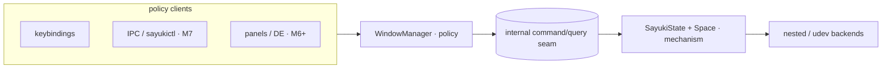
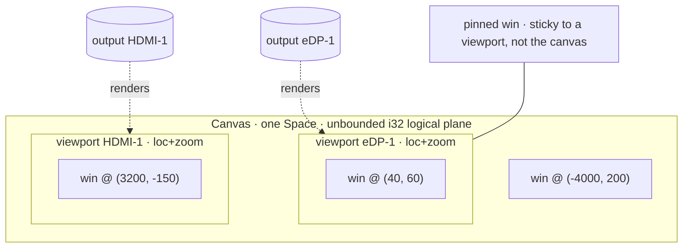
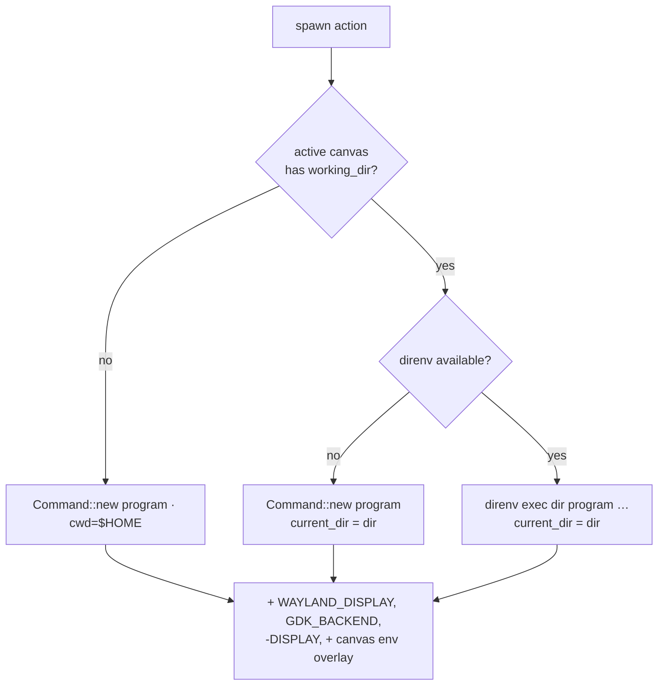

# Milestone 5 — Window Manager Model

Detailed spec for roadmap milestone 5 (`docs/roadmap.md`). Moves Sayuki from
example-compositor behavior to its own policy: a **viewport over an unbounded
canvas**, oriented around **projects**. Windows float at free, persistent canvas
coordinates; monitors are viewports on the canvas; switching project/workspace
swaps the canvas. A workspace is not a numeric slot but a project context (a
named canvas) that carries a working directory, an environment (via direnv), and
a desktop session (apps, layout, window rules).

Status: planned. Split into **5a (canvas/viewport WM core / mechanism)** and
**5b (project session layer / policy)**. 5a ships first and stands alone; 5b
builds on it.

## Guiding principle: mechanism core, policy outside, IPC seam between

Sayuki aims to grow into a full desktop environment. The single rule that keeps
that scope survivable without core rewrites:

- **Core** (`state.rs`, backends, `Space`): surfaces, outputs, input, rendering.
  Knows nothing about projects or workspaces beyond mapping/unmapping elements.
- **Policy** (new `wm` module → future `sayuki-wm`): canvases, focus, projects,
  hooks, layout, rules.
- **Seam**: an internal command/query interface the policy uses to drive the
  core. Milestone 7's IPC later exposes this same seam verbatim, so a panel, a
  `sayukictl`, or a project switcher become *more clients of the same interface*
  rather than reasons to change the core.



Non-goal for this milestone: any OS-level abstraction. The mechanism/policy/IPC
split keeps that direction *possible*; we do not pay for it now.

## Baseline (what exists today)

Grounded in `crates/sayuki-compositor/src`:

- `SayukiState` owns `space: Space<Window>` and a flat `windows: Vec<Window>`
  (`state.rs:66,68`). `Space` is the render/hit-test/output truth.
- New toplevels: `add_toplevel` (`state.rs:327`) pushes to `windows`;
  `handle_surface_commit` (`state.rs:357`) calls `place_window` (`state.rs:339`)
  on first buffered commit, staggering onto the **primary** output via
  `primary_output_geometry` (`state.rs:320`).
- Focus is derived from Smithay keyboard focus: `focused_window` (`state.rs:592`),
  set on click in `focus_window_at` (`state.rs:660`), which also
  `space.raise_element`s.
- `SwitchWorkspace(u8)` is parsed end-to-end (`config.rs:44,163`,
  `input/actions.rs:10`) but the handler is a stub (`state.rs:222`).
- Move/resize grabs mutate `Space` directly (`grabs.rs`); no model is kept.
- Spawning: `ActionRunner::spawn` (`input/spawn.rs:16`) sets `WAYLAND_DISPLAY`,
  `GDK_BACKEND=wayland`, removes `DISPLAY`, inherits the rest. **No cwd, no env
  overlay.**
- Per-output config is effectively fixed: scale 1, `Transform::Normal`
  (`output.rs:31`).

Everything is floating already — each window is a free-positioned `Space`
element, and outputs are already mapped *into* the `Space` at locations
(`state.rs:112,317`, `udev.rs:670`). In effect the `Space` is already an
unbounded **canvas** with outputs placed on it; the code only fights that by
clamping placement, xdg bounds, and the pointer to the **primary** output. 5a
names the canvas/viewport model explicitly and removes those clamps; 5b gives
canvases project meaning.

─

# 5a — Canvas / viewport WM core (mechanism)

## Model: one canvas, many viewports

Sayuki's window model is a **viewport over an unbounded canvas**:

- **Canvas** — an unbounded 2D logical plane. Each window has a *permanent*
  canvas position: it is the window's home, never "restored." Coordinates stay
  `i32` logical (Smithay's type); ±2.1e9 px is effectively infinite, with pan
  clamped to ±1e6 to keep snap/centering arithmetic overflow-proof.
- **Viewport** — an output's rectangle *in* the canvas plus a zoom factor:
  `{ loc, zoom }`. The size comes from the output's mode/scale; the output
  renders the canvas region under its viewport. Panning moves `loc`; zooming
  changes `zoom`.
- **Multiple monitors = multiple viewports on the same canvas.** By default
  contiguous, mirroring the physical output arrangement, so a window dragged
  across a bezel is seamless; each viewport pans/zooms independently
  (configurable — see *Viewports & panning*).
- **Switching project/workspace = swapping the canvas.** The physical monitors
  stay; the plane they look at changes. One canvas is active across *all*
  outputs (canvases are global; per-output divergence is per-*viewport*, not
  separate workspaces).



Key finding: **Smithay's `Space` already is this canvas.** It maps outputs into
itself at locations (`map_output`, used at `state.rs:112,317`, `udev.rs:670`),
holds elements at arbitrary coords (`map_element`), hit-tests in canvas coords
(`element_under`/`output_under`), and clips per output on render. 5a removes
"always primary," lets coordinates range freely, and adds pan/zoom/pin/snap/swap
on top.

## Data model

A **canvas is a `Space`.** `WindowManager` owns the canvases and the active one.
Switching canvases **moves the cameras (outputs), not the furniture (windows)** —
windows never unmap/remap, so positions persist for free and switching is
O(outputs), not O(windows).

```rust
pub(crate) struct WindowManager {
    canvases: Vec<Canvas>,
    active: CanvasId,
    next_id: u32,
}

#[derive(Clone, Copy, PartialEq, Eq)]
pub(crate) struct CanvasId(u32);

pub(crate) struct Canvas {
    id: CanvasId,
    name: String,                          // "1", "2", … or a project name in 5b
    space: Space<Window>,                  // THE canvas plane; render/hit-test truth
    viewports: HashMap<String, Viewport>,  // per output name: where this canvas looks
    focus: Vec<Window>,                    // MRU stack; last() = focused (canvas-local)
    pinned: Vec<Pinned>,                   // sticky-to-viewport windows (see Pinning)
    // 5b appends here (working_dir, env, hooks, …)
}

pub(crate) struct Viewport {
    loc: Point<i32, Logical>,  // canvas coord shown at the output's top-left (zoom 1)
    zoom: f64,                 // 1.0 = native; <1 zoom out, >1 zoom in
}

pub(crate) struct Pinned {
    window: Window,
    output: String,            // which output's viewport it sticks to
    anchor: ViewportAnchor,    // corner/edge + offset in output-local logical px
}
```

Window identity stays Smithay `Window` (cheap `Arc` clones, `PartialEq`,
`IsAlive`) — reusing the `windows.retain(|w| w != &window)` pattern. There is
**no** `floating_geometry` and **no** `ManagedWindow`: the per-canvas `Space`
*is* the geometry store, so the snapshot-on-unmap / restore-on-remap dance a
single shared Space would need is deleted outright (the payoff of canvas =
`Space`). "Floating vs pinned" is represented by membership in `Canvas.pinned`,
not a mode enum — less state, fewer invariants.

`SayukiState.windows: Vec<Window>` (`state.rs:68`) is **removed**; `space`
(`state.rs:66`) moves **into** `Canvas`; `SayukiState` gains `wm: WindowManager`
plus `space()`/`space_mut()` accessors returning the active canvas's `Space`, to
keep the many `self.space.*` call sites small. (Borrow note: methods that need
the `Space` *and* other `self` fields fetch the active `CanvasId` first, then
index, to satisfy the borrow checker.) Surface→window lookups (`window_for_*`
`state.rs:394,406`) scan canvases (tiny counts; linear is fine).

## Viewports & panning

- Each output has a `Viewport { loc, zoom }` in the **active** canvas. Applying
  it is `space.map_output(output, viewport.loc)` (the existing `map_output`
  sites generalize); zoom is a render/input transform, not an output location
  (see *Zoom, overview, minimap*).
- Initial viewports are **contiguous**, mirroring the physical output layout
  (`output.current_location()`), so the multi-monitor default is one continuous
  desktop and dragging across a bezel is seamless.
- Pan inputs: `PanViewport(dx, dy)` (keybind, e.g. `Mod+Arrows`), modifier-drag
  on the background, and **edge-push auto-pan** when a window is dragged past the
  viewport edge. Clamp pan to ±1e6 logical.
- **Configurable coupling** (`pan.couple`): `independent` (default) — a
  pan/zoom acts on the **focused output's** viewport only (per-monitor cameras);
  `linked` — all viewports pan/zoom together, preserving relative offsets (one
  sheet of glass). Per-output `loc`/`zoom` are always stored; coupling only
  decides whether one gesture writes one viewport or all.

## Zoom, overview, minimap (navigation)

A 2D free canvas *will* lose windows; these are the find-windows safety net, and
part of the model, not polish. All three are the **same primitive**: render the
active canvas's elements at a scale, via `RescaleRenderElement`
(`scale: Scale<f64>`, `origin: Point<_, Physical>`) plus
`RelocateRenderElement` / `CropRenderElement` for placement and clipping (all in
`smithay::backend::renderer::element::utils`, confirmed in smithay 0.7.0).

- **Continuous zoom** — `viewport.zoom`. The output shows canvas region
  `[loc, loc + output_size_logical / zoom]` rescaled to fill the output; focal
  point = pointer (zoom toward cursor) or viewport center. **Zoom 1.0 keeps the
  existing 1:1 path** (no rescale element, zero overhead in the common case).
- **Overview** — a transient mode (`ToggleOverview`) that sets the focused
  output's zoom to *fit all elements*: bounding box of `space.elements()`
  geometries → zoom that fits with margin, centered. Thumbnail interaction
  (click a window → focus + exit; drag → relocate) reuses normal hit-testing
  under the inverse zoom transform. No separate render path — just zoom + a UI
  flag.
- **Minimap** — a small persistent overview (`ToggleMinimap`) rendered into an
  output corner: the same rescaled canvas render, `CropRenderElement`-clipped to
  the minimap rect, plus a viewport-rectangle indicator. An overlay element
  after the main pass; cheap because it reuses the canvas elements.

Input under zoom: the pointer transform (`state.rs:243-245`) maps output-local
position to canvas coords as `canvas = viewport.loc + output_local.to_f64() /
zoom` before `element_under`. A zoom/pan/overview change dirties the whole output
that frame (full damage) — acceptable for interactive nav gestures.

## Pinning (sticky to viewport)

A pinned window sticks to an **output's viewport**, not the canvas: it stays in
the same screen position while the canvas pans/zooms under it (a HUD: terminal,
notes, monitor).

- Tracked in `Canvas.pinned`; `anchor` = corner/edge + offset in output-local
  logical px (e.g. top-right + (16,16)).
- Implementation (5a): the pinned window stays a `Space` element; whenever its
  output's viewport changes (pan/zoom) or the output resizes, recompute its
  Space location to `viewport.loc + anchor_in_canvas` so it renders fixed on
  screen. Under zoom it stays **native (unscaled)** like a HUD, drawn in a 1:1
  overlay pass (excluded from the `RescaleRenderElement` wrapper).
- `TogglePin`: pin → capture the current on-screen anchor from the window's
  position relative to its output; unpin → leave it at its current canvas coord
  (it becomes a normal floating window there).
- Pinned windows are **per-canvas**. Cross-canvas "show on all canvases"
  stickiness is a separate flag (see *Deferred*).
- Conceptual note: pin-to-viewport is the same shape as a layer-shell overlay
  surface; if the overlay pass grows it can share M6's layer-shell rendering. 5a
  keeps a minimal self-contained implementation.

## Placement (no clamp)

Replace "always primary":

- New window placed at a free, staggered spot in the **viewport under the
  pointer** (`space.output_under(pointer_location)` → its viewport region):
  location = `viewport.loc + stagger`, not the primary output's origin.
- xdg `state.bounds` (`state.rs:344,387`) and maximize/fullscreen sizing
  (`wayland.rs:202-228`) use the **window's current output** geometry, not
  `primary_output_geometry`.
- **No clamping of window position to an output.** Windows may sit between
  viewports, fully off-screen, or arbitrarily far — reachable by pan/overview.
  This is the core behavioral change vs an output-clamped floating model.
- The pointer clamp (`state.rs:232-234,243-245`) targets the **union of the
  active canvas's viewports**, not `primary_output_geometry`, so the cursor
  travels across all monitors and the gaps between them.

## Focus stack + reveal-on-focus

`Canvas.focus` is the per-canvas MRU stack. Invariants:

- Each member appears exactly once; `last()` is most recently focused.
- `focus(w)`: move `w` to tail; mirror with `space.raise_element` +
  `keyboard.set_focus`.
- Map: new window pushed to tail of the active canvas and focused.
- Unmap/close: remove from its canvas; if it was focused, focus the new tail
  (deterministic focus-after-close).
- Canvas switch restores focus to the destination's tail.

New actions for explicit cycling within the active canvas:

- `FocusNext` / `FocusPrev` — cycle MRU order, active canvas only.
- `MoveWindowToCanvas(CanvasRef)` — reassign the focused window: pull from the
  active canvas's `space` + `focus`, push into the target canvas's `space` (at a
  placed coord) + `focus`. The window moves **between Spaces**.

**Reveal-on-focus** (navigation safety net): focusing a window outside its
output's current viewport pans the viewport the minimum distance to bring it
fully into view (niri-style scroll-into-view). With `pan.couple = linked` the
whole sheet pans; independent, just that window's output.

## Snap-on-drag

Layered on free positioning — it only adjusts the **drop point**; storage stays
free `(x, y)`.

- During an interactive move grab (`grabs.rs:141`, `MoveSurfaceGrab`), magnetize
  the dragged window's edges to attractors within `snap.threshold` (default 16
  logical px): other windows' edges (flush / gap-consistent), viewport/output
  edges, and an optional soft grid (`snap.grid = 0` disables; `> 0` = pitch).
- It is a target-location adjustment inside the grab, not a layout mode. Optional
  snap guides while dragging.
- Config: `snap.threshold`, `snap.grid`, `snap.to_windows`, `snap.to_edges`.

## Swap

A discrete reorder, distinct from snap.

- **Drop-onto-window**: releasing a move grab with the pointer over another
  window **exchanges the two windows' canvas rectangles** (position and size).
- **Keybind**: `SwapWindow(Direction)` swaps the focused window with the
  geometrically nearest window in a direction (by center); `SwapWindow(Next |
  Prev)` swaps along MRU.
- Swap mutates the two windows' Space locations (and sizes via xdg configure);
  focus stays on the moved window.

## Canvas switching

Implements the (now canvas-oriented) `SwitchWorkspace` handler (`state.rs:222`).
**Switch moves the cameras, not the furniture.** From `old` → `to`:

1. For each output `o`: `old.space.unmap_output(o)`.
2. `old.space.refresh()` — emits `wl_surface.leave` to the old canvas's windows.
3. Set `active = to`.
4. For each output `o`: `to.space.map_output(o, to.viewports[o].loc)`, creating a
   default contiguous viewport if this canvas has not been shown on `o` before.
5. `to.space.refresh()` — emits `wl_surface.enter` to the new canvas's windows.
6. Restore focus to `to.focus` tail (or clear if empty); `space.raise_element`;
   `keyboard.set_focus`.
7. `send_pending_window_configures` (`state.rs:679`); request a **full redraw**
   (canvas swap = full damage).

Windows never move between Spaces on switch; their positions are intact in their
own canvas's Space. Inactive canvases receive no frame callbacks (correct —
nothing of theirs is visible).

Output lifecycle fans out across canvases — the one localized cost of canvas =
`Space`:

- Hotplug add (`udev.rs:669-671`): map the new output into **every** canvas at a
  default viewport contiguous with existing outputs; live in the active canvas
  immediately.
- Removal (`udev.rs:630-666`): `unmap_output` from **every** canvas; windows
  only visible via that output keep their canvas coords (reach them by panning
  another viewport or via overview).
- Mode/scale change: size is read from the shared `Output`, so per-canvas
  viewport `loc` is unaffected; re-clamp only if needed.

This replaces a shared-Space "unmap/map all windows on switch" plus its geometry
snapshot/restore — both unnecessary when each canvas owns its `Space`.

## Touched symbols (5a)

`state.rs`: remove `windows` (`:68`); `space` (`:66`) → `Canvas`; add `wm` +
`space()`/`space_mut()` accessors. Rework `add_toplevel` (`:327`),
`remove_toplevel` (`:332`), `place_window` (`:339`, drop clamp +
viewport-under-pointer), `handle_surface_commit` (`:357`),
`ensure_initial_configure` (`:375`, bounds from the window's output),
`window_for_*` (`:394,:406`, scan canvases), `focus_window_at` (`:660`),
`focused_window` (`:592`), pointer move/abs (`:232-234,:243-245`, clamp to the
viewport union + invert zoom), `run_action` SwitchWorkspace arm (`:222` → canvas
switch).
`wayland.rs`: maximize/fullscreen (`:202-228`) size from the window's output, not
`primary_output_geometry`.
`grabs.rs`: `MoveSurfaceGrab` (`:141`) — snap-on-drag, drop-to-swap, edge-push
auto-pan.
`backend/udev.rs` + `backend/nested.rs`: per-output render pass gains
zoom/overview/minimap (`RescaleRenderElement`) and the pinned-overlay (1:1)
pass; output add/remove fan out across canvases (`udev.rs:630-671`).
`input/actions.rs`: add `PanViewport`, `ZoomViewport`, `ToggleOverview`,
`ToggleMinimap`, `TogglePin`, `SwapWindow(dir | next | prev)`, `FocusNext`,
`FocusPrev`, `MoveWindowToCanvas`; generalize the workspace-switch action to a
canvas switch (`SwitchWorkspace` kept as a user-facing alias).
`config.rs`: keybinding actions for the above; `pan.couple`, `snap.*`, viewport
defaults; generalize the `workspace` ref to index **or** name (see 5b).

## Acceptance (5a)

- Two clients on canvas 1; switching to canvas 2 shows canvas 2 on all outputs
  while canvas 1's windows keep their exact positions (unmoved in their own
  Space); switching back restores them with focus on the previously focused one
  — with no per-window snapshot/restore involved.
- A window dragged past the viewport edge stays at its canvas coordinate fully
  off-screen; panning (or overview) brings it back at the same place.
- With two outputs arranged side by side, a window dragged across the bezel moves
  continuously across the seam (contiguous viewports), and the pointer travels
  across both outputs and the gap between them.
- Pinning a terminal top-right keeps it fixed in that output's top-right while
  the canvas pans under it; unpinning drops it at its current on-screen position
  as a floating window.
- Focusing an off-screen window pans its output minimally until the window is
  fully visible (reveal-on-focus).
- Dragging a window within threshold of another window's edge snaps flush; with
  `snap.grid = N`, drops land on the N-grid; a 1px nudge afterward is honored
  (storage is free coords).
- Dropping window A onto window B exchanges their rectangles; `SwapWindow(Right)`
  swaps with the nearest window to the right.
- Overview zooms the focused output out to fit all canvas windows; minimap shows
  the canvas with a viewport indicator; the zoom-1.0 path renders identically to
  today (no rescale overhead).
- `FocusNext`/`FocusPrev` cycle only the active canvas's windows.

─

# 5b — Project session layer (policy)

A canvas becomes a project context. **direnv owns the environment; Sayuki
owns the windows/session.** They compose on the same project directory; neither
reimplements the other.

| Concern | Owner | File |
|---|---|---|
| environment (devshell, dotenv, flake, layouts) | **direnv** | `.envrc` |
| desktop session (apps, layout, window rules, output) | **Sayuki** | `.sayuki` / central config |

## Canvas project context

Append to `Canvas`:

```rust
working_dir: Option<PathBuf>,
env: Vec<(String, String)>,   // small overlay; NOT a replacement for inherited env
hooks: CanvasHooks,
initialized: bool,            // one-shot guard for on_init
trusted: bool,                // gate before running discovered session files

pub(crate) struct CanvasHooks {
    on_init:    Option<HookCmd>,  // ONCE, first activation (one-shot via `initialized`)
    on_enter:   Option<HookCmd>,  // every activation; MUST be idempotent
    on_leave:   Option<HookCmd>,
    on_destroy: Option<HookCmd>,
}
pub(crate) enum HookCmd { Shell(String), Args(Vec<String>) }
```

A bare canvas (no `working_dir`/`hooks`) degenerates to a plain 5a canvas —
one type, no fork. (There is no per-canvas `output` preference: a canvas is
global across outputs; "where" is a per-viewport concern, not a project one.)

## direnv contract

Justification: **a compositor spawning children is a non-interactive context, so
direnv's shell hook never fires.** direnv must be invoked explicitly — this is
its supported integration path, not a workaround.
([direnv(1)](https://direnv.net/man/direnv.1.html),
[non-interactive load](https://github.com/benkruger/flow/issues/367))

### Spawn context

```rust
pub(crate) struct SpawnContext<'a> {
    cwd: Option<&'a Path>,
    env: &'a [(String, String)],
}
```

Default context = the **active canvas's** `working_dir` + `env`. (Canvases are
global across outputs; the focused output decides *where* a window lands, while
cwd/env come from the active canvas.)

### Spawn integration (change site: `input/spawn.rs:16-29`)

When the context has a `cwd` and direnv is enabled:

```rust
let mut command = Command::new("direnv");
command.arg("exec").arg(dir).arg(program).args(rest);
command.current_dir(dir);                 // set cwd ourselves; do not rely on exec's chdir
command.env("DIRENV_LOG_FORMAT", "");     // silence the "direnv: loading…" banner
// keep existing WAYLAND_DISPLAY / GDK_BACKEND / env_remove(DISPLAY); then apply ctx.env overlay
```

- `direnv exec DIR CMD` loads the first `.envrc`/`.env` in DIR, then runs CMD
  ([man](https://direnv.net/man/direnv.1.html)).
- **Fallback**: direnv binary missing (ENOENT) or no `working_dir` → spawn the
  program directly with `cwd` set. Degrade, log, never block input.
- **Allow gate**: `.envrc` is blocked until `direnv allow`; `exec` then runs the
  command *without* the project env. Surface this as project status
  ("env pending") rather than silently launching env-less.
- Env precedence: inherited (keeps `WAYLAND_DISPLAY`) → canvas `env` overlay →
  fixed Wayland vars.

Chosen shape: **`direnv exec` per spawn** — always correct, picks up `.envrc`
edits for free, one extra short-lived process per human-triggered spawn.
Alternative `direnv export json` (parse `{key: value|null}`, null = unset;
requires direnv ≥ 2.8.0; malformed when the dir is not allowed,
[#467](https://github.com/direnv/direnv/issues/467)) is an optimization to adopt
only if per-spawn latency ever matters.



No new crate dependency — `std::process::Command`. direnv is a soft runtime
dependency.

## `.sayuki` project file — config that travels with the repo

Mirrors direnv's discovery model: opening a directory as a project discovers a
`<dir>/.sayuki` (TOML) describing what that project *looks like*.

```toml
# ~/projects/sayuki/.sayuki
layout = "floating"
apps = ["ghostty", "zed ."]                  # launched via `direnv exec <dir> …`
on_init = "firefox -P sayuki --new-window"   # imperative escape for profile launches

[[window_rule]]
app_id = "firefox"
title  = "sayuki"
pin    = true                                # route the matching surface back to this canvas
```

- `apps` — **declarative**, launched through the direnv-wrapped spawn so they
  inherit `.envrc`.
- `on_init` — **one-shot imperative escape** (guarded by `initialized`) for
  single-instance apps where cwd/env cannot route the window (browsers fork into
  an existing process and ignore spawn context). Pairs with `window_rule.pin`.

Central config defines pinned projects too; both feed the same `Canvas`
builder:

```toml
# ~/.config/sayuki/config.toml
[[project]]
name = "sayuki"
path = "~/projects/sayuki"
env  = { RUST_LOG = "debug" }                # small overlay; .envrc still owns the rest
on_init = "firefox -P sayuki --new-window"
```

Keybindings bind to a project by **name or index** (generalized canvas switch,
backward compatible with `workspace = 1`):

```toml
[[keybindings]]
keys = "Mod+1"
action = "workspace"
workspace = "sayuki"     # or: workspace = 1
```

## Trust gate

A `.sayuki` launches processes, so it is as dangerous as an `.envrc`. Mirror
`direnv allow`:

- Maintain an allowlist at `~/.local/state/sayuki/trusted` keyed by project path
  **+ content hash** of `.sayuki` (editing the file re-blocks until re-allowed,
  like direnv).
- Untrusted directory → the discovered `.sayuki` is **ignored entirely**; the
  project still opens with defaults, surfaced as "untrusted — run allow".
- Central-config `[[project]]` entries are inherently trusted (the user wrote
  them).
- `sayukictl project allow <dir>` lands with IPC (milestone 7); until then,
  trust comes only from central config.

## Window rules

Minimal map-time routing, evaluated in `handle_surface_commit`/`place_window`:

- Match fields: `app_id`, `title` (substring/glob). Extend later (transient/parent).
- Actions: `pin` to a canvas, set `floating`/`pinned`, set initial floating
  geometry, prefer an output.
- Resolves the browser race: `on_init` launches the profile window; the rule
  pins the resulting surface to the project canvas even though it arrives via
  the pre-existing browser process and races the switch.

## Per-output scale and transform policy

Static, config-driven; overlaps output code more than window code:

```toml
[[output]]
name = "eDP-1"
scale = 2
transform = "normal"
```

- Introduce `OutputPolicy { scale, transform }` resolved by output name,
  applied in `output.rs:31` (`configure_output`) and udev output creation
  (`backend/udev.rs`).
- Default preserved: scale 1, `Transform::Normal`. **No dynamic re-scale** —
  defer fractional/dynamic scale to milestone 6 (fractional-scale protocol).

## Touched symbols (5b)

`input/spawn.rs`: `spawn` takes `SpawnContext`; direnv-wrapped command + fallback.
`state.rs`: resolve `SpawnContext` from the active canvas in the `Spawn` arm
(`:219`); run hooks on activation; route new windows through rule evaluation.
`config.rs`: `[[project]]`, `[[output]]`, generalized `workspace` ref; `.sayuki`
loader + trust check.
`output.rs` / `backend/udev.rs`: apply `OutputPolicy`.

## Acceptance (5b)

- Unit: with a project context whose `working_dir = /p`, the built command argv
  is `["direnv","exec","/p","ghostty"]` with `current_dir == /p`; with direnv
  absent, it is `["ghostty"]` with `current_dir == /p`.
- Unit: env overlay never drops `WAYLAND_DISPLAY`.
- Unit: an untrusted `.sayuki` yields no `apps`/`on_init` execution; a trusted
  one runs `on_init` exactly once and not again on re-enter (`initialized`).
- Unit: a `window_rule { app_id="firefox", pin }` assigns a matching window to
  the project canvas, not the active one.
- Manual: `Mod+Enter` in a project canvas opens a terminal already `cd`'d into
  the project dir, with `.envrc` env present when the dir is direnv-allowed.

─

## Testing strategy

The compositor is hard to drive in CI, so target the pure logic with unit tests
(the repo already unit-tests parsing in `input/keybindings.rs`):

- Canvas switch state machine: cameras move, windows stay put in their own Space,
  focus round-trips to the destination tail.
- Focus-stack invariants: single occurrence, MRU tail, focus-after-close.
- Viewport coordinate transforms: output-local ↔ canvas under pan and zoom,
  including the `/ zoom` inversion for hit-testing and the clamp to the viewport
  union.
- Reveal-on-focus: minimal pan that makes an off-screen window fully visible.
- Snap target computation: thresholds, grid pitch, window/edge attractors,
  precedence; storage stays free coords.
- Swap: rectangle exchange (drop-onto-window and directional/MRU keybinds).
- Pin: anchor recompute keeps the window screen-fixed across pan/zoom/resize;
  unpin lands at the current on-screen coord.
- Placement-under-pointer with no clamp (window may land off all outputs).
- `SpawnContext` → `Command` construction (direnv on/off, env overlay, cwd).
- Config + `.sayuki` parsing, `workspace` name/index, rule matching.
- Trust allowlist: path+hash gate, re-block on edit.

Live behavior (placement, rendering, zoom/overview/minimap, real direnv env) is
verified manually in the nested `winit` backend.

## Decisions

| Fork | Choice | Why |
|---|---|---|
| Window model | Viewport over an unbounded canvas | Free, persistent placement; monitors are viewports; project switch = canvas swap. |
| Canvas scope | One active canvas across all outputs (global) | Monitors are viewports on the shared canvas; per-output divergence is per-viewport pan/zoom, not separate workspaces. |
| Multi-canvas storage | Canvas = its own `Space`; switch moves outputs, not windows | O(outputs) switch; positions persist for free; deletes the snapshot/restore a shared Space needs. |
| Coordinate range | `i32` logical, pan clamped ±1e6 | Matches Smithay; effectively infinite; overflow-safe arithmetic. |
| Pinning | Sticky to viewport, per-canvas | A HUD layer the canvas scrolls under; cross-canvas sticky deferred. |
| Layout assist | Snap-on-drag + swap, no tiling | Free placement with ergonomics; replaces tiling. |
| Navigation | Reveal-on-focus + overview/zoom/minimap | A 2D free canvas needs a find-windows safety net. |
| Zoom render | `RescaleRenderElement`; zoom 1.0 keeps the 1:1 path | One primitive for zoom/overview/minimap; zero overhead unzoomed. |
| Viewport coupling | Configurable independent (default) / linked | Per-monitor cameras by default; linked = one sheet of glass. |
| Env mechanism | direnv via `direnv exec` per spawn | Don't reinvent env; matches existing workflow; correct in non-interactive context. |
| Session config | per-dir `.sayuki` + central `[[project]]` | Config travels with the repo (direnv-style) and supports pinned projects. |
| Trust | Independent Sayuki allowlist (path + content hash) | Explicit, mirrors `direnv allow`, no coupling to direnv's trust DB. |
| App launching | one-shot `on_init` + declarative `apps` | Idempotent common case; imperative escape for browsers. |
| Window identity | Smithay `Window` (5a); serializable `WindowId(u64)` arrives with milestone 7 IPC | Cheap clones now; a stable id is only needed when IPC references windows across the socket. |

## Deferred (later milestones / follow-ups)

- Cross-canvas pinning ("show on all canvases").
- Declarative app **reconciliation** (spawn-if-absent, respawn on crash) over the
  one-shot `apps`/`on_init`.
- Tiling layouts (snap/swap is the floating-first substitute; explicit tiling, if
  ever, layers on the same model).
- Snap guides and animated pan/zoom transitions (polish).
- Session persistence across compositor restart (canvas layout + viewports).
- IPC + `sayukictl` + live config reload (milestone 7); `project allow`,
  `project open <dir>` arrive there.
- Fractional/dynamic scale (milestone 6); zoom render shares its render-element
  groundwork.

## Crate plan impact

5a/5b live as a `wm` module inside `crates/sayuki-compositor`, extracted to
`sayuki-wm` once the interface stabilizes (per the roadmap workspace plan). If
process supervision/hooks grow (reconciliation, restart policy, per-project
services), that becomes a future `sayuki-session` crate — not currently listed.
