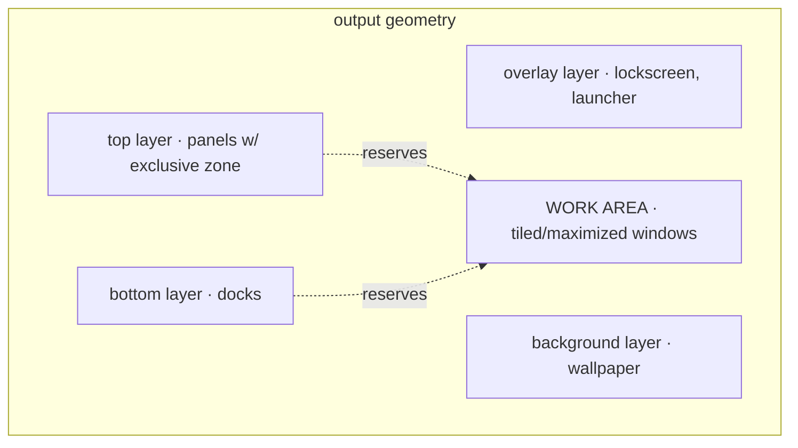

# Milestone 6 — Desktop Protocols and Shell Foundation

Detailed spec for roadmap milestone 6 (`docs/roadmap.md`). Turns Sayuki from a
window manager into the foundation of a desktop environment: the protocols a
shell renders through, the protocols the existing Wayland ecosystem needs for
interop, and the session/security/input surface a daily-driver DE requires.

Status: planned. Depends on milestone 5 (`docs/milestone-5-window-manager-model.md`)
and feeds milestone 7 (`docs/milestone-7-config-and-ipc.md`). Reference-first:
most of this is wiring Smithay handlers, not inventing protocol glue.

## Guiding principle: dual transport (IPC + standard protocols)

A DE has two distinct consumers of compositor state, and they get two different
transports:

| Consumer | Transport | Why |
|---|---|---|
| **First-party shell** (Sayuki's own panel, switcher, project UI) | **Sayuki IPC** (milestone 7) | Project-aware, richer than any standard protocol, type-safe via `sayuki-ipc` |
| **Third-party ecosystem** (waybar, grim/slurp, wl-clipboard, swayidle, fuzzel, swaylock-likes) | **standard wlr/ext protocols** | Interop, and a working desktop *before* every first-party piece exists |

Build both. Standard protocols are how you get a usable desktop from existing
tools while the first-party shell is written; IPC is the project-aware brain.
They do not conflict — a panel can read windows over IPC while `grim` screenshots
over screencopy.

## Baseline (what exists today)

Grounded in `crates/sayuki-compositor/src`:

- Delegates wired in `main.rs:87-92`: `compositor`, `data_device`, `output`,
  `seat`, `shm`, `xdg_shell`. That is the entire protocol surface.
- Handlers in `wayland.rs`: `BufferHandler`, `CompositorHandler`,
  `XdgShellHandler` (toplevel + popup), `OutputHandler` (empty),
  `SelectionHandler` (`SelectionUserData = ()`), `DataDeviceHandler`,
  `ClientDndGrabHandler`/`ServerDndGrabHandler` (empty), `SeatHandler`,
  `ShmHandler`. `ClientState` holds only `CompositorClientState` (`wayland.rs:288`).
- `wl_output` is advertised via `Output::create_global` (`output.rs:25`) — there
  is **no** `OutputManagerState`, so **no xdg-output**.
- No layer-shell, decoration, primary-selection, data-control, fractional-scale,
  viewporter, presentation-time, session-lock, idle, foreign-toplevel,
  screencopy, IME, pointer-constraints, activation, or security-context.

So M6 is mostly greenfield protocol additions. Each is a `State::new` in
`SayukiState::new` (`state.rs:94-97` is the pattern) + a `Handler` impl in
`wayland.rs` + a `delegate_*!` in `main.rs`.

─

## Protocol plan (tiered by DE priority)

The flat roadmap list hides the dependency order. Build in tiers.

### Tier 0 — shell foundation (nothing is a "desktop" without it)

| Protocol | DE purpose | Smithay |
|---|---|---|
| **wlr-layer-shell** | panels, bars, backgrounds, notifications, launchers, lock surfaces | `wayland::shell::wlr_layer::{WlrLayerShellState, WlrLayerShellHandler}`, `desktop::LayerSurface`, `desktop::layer_map_for_output` |
| **xdg-output** | logical output name/geometry for panels | swap `delegate_output` for `OutputManagerState::new_with_xdg_output` |

### Tier 1 — ecosystem interop (cheap, unblocks real tools)

| Protocol | DE purpose | Smithay |
|---|---|---|
| **ext-foreign-toplevel-list** | external taskbars/docks enumerate windows | `wayland::foreign_toplevel_list` (verify version) |
| **wlr-foreign-toplevel-management** | external control (activate/close/fullscreen) | may need custom glue — verify |
| **wlr/ext-data-control** | clipboard managers (`wl-clipboard`, `cliphist`) | `wayland::selection::wlr_data_control::DataControlState` |
| **wlr-screencopy** / **ext-image-copy-capture** | screenshots, basis for screencast | verify current Smithay support; anvil has an example; may need glue |

### Tier 2 — session & security

| Protocol | DE purpose | Smithay |
|---|---|---|
| **ext-session-lock** | real lock screen | `wayland::session_lock::SessionLockManagerState` |
| **idle-notify** | screensaver/lock triggers | `wayland::idle_notify::IdleNotifierState` |
| **idle-inhibit** | "don't sleep while playing video" | `wayland::idle_inhibit::IdleInhibitManagerState` |

### Tier 3 — input completeness (DE-grade, frequently forgotten)

| Protocol | DE purpose | Smithay |
|---|---|---|
| **text-input-v3 + input-method-v2** | IME (fcitx5/ibus) | `wayland::text_input::TextInputManagerState`, `wayland::input_method::InputMethodManagerState` |
| **virtual-keyboard** | on-screen keyboards | `wayland::virtual_keyboard::VirtualKeyboardManagerState` |
| **pointer-constraints + relative-pointer** | games, remote desktop | `wayland::pointer_constraints::PointerConstraintsState`, `wayland::relative_pointer::RelativePointerManagerState` |
| **cursor-shape** | client cursor naming without pixmaps | `wayland::cursor_shape` (verify) |
| **tablet** | drawing tablets | `wayland::tablet_manager::TabletManagerState` |
| **xdg-activation** | focus-stealing prevention, urgency tokens | `wayland::xdg_activation::XdgActivationState` |

### Tier 4 — visual polish

| Protocol | DE purpose | Smithay |
|---|---|---|
| **xdg-decoration** | SSD vs CSD negotiation | `wayland::shell::xdg::decoration::{XdgDecorationState, XdgDecorationHandler}` |
| **fractional-scale + viewporter** | HiDPI; pairs with M5 per-output scale | `wayland::fractional_scale::FractionalScaleManagerState`, `wayland::viewporter::ViewporterState` |
| **presentation-time** | client vsync timing | `wayland::presentation::PresentationState` |
| **primary-selection** | middle-click paste | `wayland::selection::primary_selection::PrimarySelectionState` |

### Far

- **XWayland** — legacy X11 apps. Large integration. `xwayland::{XWayland,
  XWaylandShellState}`. Defer until native clients are solid.
- **xdg-desktop-portal backend** — a separate DBus service
  (`xdg-desktop-portal-sayuki`) implementing ScreenCast (screencopy + PipeWire),
  Screenshot, Settings, GlobalShortcuts, Inhibit. How browsers/Flatpak do screen
  share. Direction, not a milestone-6 task.
- **gamma-control / output-power-management (wlr)** — night light, DPMS. Likely
  custom glue.

─

## The M5⇄M6 coupling: work area

layer-shell forces a concept milestone 5 does not have: a per-output **work
area** = output geometry minus the exclusive zones reserved by anchored
layer-shell surfaces (panels/bars).

Contract introduced into `WindowManager`:

- **Work area per output** = `output_geometry − Σ exclusive_zones`. Smithay's
  `layer_map_for_output(output).non_exclusive_zone()` computes this; recompute on
  layer surface map/unmap/commit and on output change.
- **Placement / maximize / tiling** target the work area, not raw output geometry.
  This replaces M5's use of `primary_output_geometry` (`state.rs:320`) and the
  output-aware placement target with a work-area lookup.
- **Fullscreen** = full output (ignores reservations).
- **Stacking order** (render + hit-test): background → bottom → workspace windows
  → top → overlay. The render paths (`state.rs:606` nested, `udev.rs:313`) must
  composite layer surfaces in this order around the `Space` elements.
- **Keyboard interactivity**: layer surfaces request `none` / `on-demand` /
  `exclusive`. `exclusive` (lock screen, some launchers) takes keyboard focus
  away from windows; `on-demand` takes focus on click. Focus routing in
  `focus_window_at` (`state.rs:660`) and the keyboard path must account for
  focused layer surfaces, not only `Space` windows.

This is the main retrofit M6 makes into the M5 model.

## layer-shell integration detail

- Track layer surfaces via `desktop::LayerSurface` and Smithay's per-output layer
  map (`layer_map_for_output`), which already handles anchoring, exclusive zones,
  and arrangement — do not hand-roll geometry.
- Map/commit lifecycle parallels xdg toplevels: initial configure, ack, commit
  with buffer → arrange. Add a `WlrLayerShellHandler` alongside `XdgShellHandler`
  in `wayland.rs`.
- Notification daemons (e.g. `mako`, `swaync`) and bars (`waybar`) are layer
  clients — they are the first external validation targets.

## Decoration policy

Decision: **server-side decorations by default, CSD opt-in.** Implement
`XdgDecorationHandler` to request SSD; honor clients that insist on CSD. Actual
titlebar/border drawing is deferred to a future `sayuki-render` — initially SSD
can mean "no client titlebar, compositor draws minimal/no chrome" to keep the
look consistent. This keeps the DE's appearance under Sayuki's control rather than
each toolkit's.

## HiDPI (fractional-scale + viewporter)

Pairs with M5's per-output `OutputPolicy { scale, transform }`. Advertise
`wp-fractional-scale` + `wp-viewporter` together (fractional scale is meaningless
without viewporter buffer scaling). Send `preferred_scale` per output from the
resolved `OutputPolicy`. No dynamic re-scale beyond config/hotplug in M6.

## Session & idle

- `ext-session-lock`: on lock, a lock client draws an `exclusive` overlay across
  every output; input is captured until unlock. Integrates with the lock-screen
  story and must survive output hotplug (re-create lock surfaces for new outputs).
- `idle-notify` + `idle-inhibit`: idle timers feed a future power/session manager
  (DPMS off, auto-lock); inhibitors (video players, presentations) suspend the
  timers.

## Security-context (ties to milestone 7 IPC)

Implement `wayland::security_context::SecurityContextState` so Sayuki can identify
sandboxed (Flatpak) clients. Used by milestone 7 to **withhold the IPC socket and
privileged protocols** from sandboxed clients; the xdg-desktop-portal mediates
those instead. Same-user processes are otherwise trusted.

─

## Touched symbols (M6)

- `state.rs`: new protocol `State` fields in `SayukiState` + `::new`
  (`:60-84`, `:94-97`); work-area lookup replacing `primary_output_geometry`
  (`:320`) in placement/configure; layer-surface compositing in `render`
  (`:606`); layer focus in `focus_window_at` (`:660`).
- `wayland.rs`: new `Handler` impls (layer-shell, decoration, primary-selection,
  data-control, fractional-scale, activation, session-lock, idle, input-method,
  text-input, pointer-constraints, …). `ClientState` gains per-client protocol
  data where required (e.g. security-context state).
- `main.rs`: corresponding `delegate_*!` macros; swap `delegate_output` usage for
  `OutputManagerState`.
- `backend/udev.rs` (`:313`) and the nested render path: composite layer surfaces
  in the defined stacking order.
- `output.rs`: send fractional `preferred_scale` per `OutputPolicy`.

## Acceptance (M6)

- `waybar` runs as a top-layer client, reserves an exclusive zone, and maximized
  windows occupy only the remaining work area (not under the bar).
- A wallpaper client (`swaybg`) renders on the background layer behind windows.
- `grim`/`grim -g "$(slurp)"` captures the screen (screencopy).
- `wl-copy`/`wl-paste` round-trip the clipboard (data-control).
- A `swaylock`-style client locks every output and survives plugging a second
  output while locked (session-lock).
- An IME (fcitx5) composes text into an xdg client (text-input + input-method).
- A maximized window relayouts correctly when the panel's exclusive zone changes.

## Testing strategy

- Unit: work-area computation (output geometry minus exclusive zones, multiple
  panels, multiple outputs); stacking order; focus routing with an `exclusive`
  layer surface present.
- Manual (nested `winit` backend): each acceptance bullet against the real
  third-party client named.

## Decisions

| Fork | Choice | Why |
|---|---|---|
| Shell data path | IPC (first-party) + standard protocols (interop) | Working desktop now via existing tools; project-aware brain via IPC |
| Decorations | SSD default, CSD opt-in | DE controls its look; toolkits can still opt out |
| Window control for external tools | expose foreign-toplevel | waybar/taskbars work without being first-party |
| HiDPI | fractional-scale + viewporter, static per output | Correct scaling; defer dynamic re-scale |

## Deferred

XWayland; xdg-desktop-portal backend (+ PipeWire screencast); gamma/output-power
management; dynamic/per-surface scale; tablet/pen pressure curves; the actual
decoration rendering (`sayuki-render`).

## Crate plan impact

Protocol handlers stay in the compositor / future `sayuki-core`. A first-party
shell (`sayuki-shell`) and `xdg-desktop-portal-sayuki` (DBus + PipeWire) are
separate later crates — direction, not built here. Any custom protocol XML
(if foreign-toplevel-management/screencopy need it) lands in `sayuki-protocols`.
