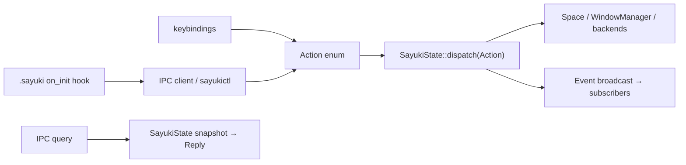

# Milestone 7 — Configuration and IPC

Detailed spec for roadmap milestone 7 (`docs/roadmap.md`). Makes Sayuki
scriptable and configurable, and gives the project-oriented DE its control plane:
a Unix-socket IPC protocol, a shared `sayuki-ipc` crate, and a `sayukictl` client.

Status: in progress. Builds on milestone 5
(`docs/milestone-5-window-manager-model.md`) and milestone 6
(`docs/milestone-6-desktop-protocols.md`).

## Guiding principle: one seam, two callers

The architectural rule from milestone 5 (mechanism core / policy / IPC seam)
becomes concrete here: define **one** internal command/query interface that
*both* keybindings and IPC dispatch into. There is no second code path.



`CompositorAction` (`input/actions.rs:4`) is already the command half. M7
generalizes it into a serializable `Action` in the shared crate; keybindings map
config to `Action`, IPC carries `Action` directly. Queries and events are the new
read/stream halves.

Second principle: **the config file is the source of truth + hot reload; IPC
issues actions and ephemeral runtime tweaks that are not persisted.** This keeps
configuration reproducible (unlike sway's runtime mutation, which drifts from the
file).

## Baseline (what exists today)

- `SayukiConfig::load` (`config.rs:71`) parses one TOML file once at startup
  (`main.rs:36`); no reload, no layering. Sections: `keyboard`, `keybindings`
  only. `RawKeybindingConfig` (`config.rs:54`) already supports `workspace` as a
  `u8`.
- `CompositorAction` (`input/actions.rs:4`): `None`, `Quit`, `Spawn`, `BeginMove`,
  `BeginResize`, `SwitchWorkspace(u8)`. Dispatched in `run_action`
  (`state.rs:212`).
- The event loop is single-threaded calloop (`main.rs:37,76-82`); sources are
  added via `loop_handle.insert_source` (Wayland listener at `main.rs:64`,
  libinput/udev/drm in `backend/udev.rs`). This is exactly the integration point
  for IPC.
- `ActionRunner` advertises `WAYLAND_DISPLAY` to children (`spawn.rs:27`); the IPC
  socket will be advertised the same way.

─

# IPC

## Transport & loop integration

IPC is **just another calloop source**, mirroring the Wayland listener at
`main.rs:64`:

```rust
let ipc = IpcListener::bind(&socket_path)?;          // UnixListener, non-blocking
loop_handle.insert_source(ipc, |event, _, state: &mut SayukiState| {
    state.handle_ipc(event);   // accept / read frame / dispatch / write — all on the loop
})?;
```

- **Single-threaded**: no shared state, no mutex. Every request dispatches into
  `&mut SayukiState` on the same loop as Wayland dispatch and rendering.
- **Socket path**: per-instance, in `$XDG_RUNTIME_DIR`:
  `sayuki-<wayland_display>.sock`. Remove a stale socket on bind.
- **Advertisement**: set `SAYUKI_SOCKET` in the compositor env and inject it into
  spawned children alongside `WAYLAND_DISPLAY` (extend `spawn.rs:27-29`), so
  hooks, scripts, and `sayukictl` find the right instance with zero config.
- **Per-connection state**: each accepted `UnixStream` is registered as its own
  calloop source with a read buffer (partial frames) and a bounded write buffer
  (events). A connection is request/reply until it sends `Subscribe`, after which
  the server pushes events to it.

## Shared crate: `sayuki-ipc`

One crate owns the wire types, depended on by the compositor, `sayukictl`, and any
first-party Rust client — type-safe end to end (the niri model). Already listed in
the roadmap workspace plan.

```rust
pub const PROTOCOL_VERSION: u32 = 1;

#[derive(Serialize, Deserialize)]
pub enum Request {
    GetVersion,
    GetWorkspaces,
    GetWindows,
    GetOutputs,
    GetProjects,
    GetFocused,
    Action(Action),                 // SAME enum keybindings dispatch
    Subscribe(Vec<EventKind>),      // this connection becomes an event stream
}

#[derive(Serialize, Deserialize)]
pub enum Action {                   // the unified command seam
    // workspaces / projects
    SwitchWorkspace(WorkspaceRef),  // Index(u8) | Named(String)
    MoveWindow { window: Option<WindowId>, workspace: WorkspaceRef },
    CreateWorkspace { name: String }, DestroyWorkspace(WorkspaceRef),
    ProjectOpen { path: PathBuf }, ProjectClose(WorkspaceRef),
    ProjectAllow { path: PathBuf }, ProjectReload(WorkspaceRef),
    // windows
    FocusWindow(WindowTarget),      // Id | Next | Prev | Direction
    CloseWindow(Option<WindowId>),
    MoveResize { window: Option<WindowId>, .. },
    ToggleFloating(Option<WindowId>), SetFullscreen { window: Option<WindowId>, on: bool },
    // outputs / compositor
    SetOutput { name: String, scale: Option<f64>, transform: Option<Transform>, mode: Option<Mode>, enabled: Option<bool> },
    Spawn { argv: Vec<String> },
    ReloadConfig,
    Quit,
}

#[derive(Serialize, Deserialize)]
pub enum Reply {
    Ok,
    Error(String),
    Version { compositor: String, protocol: u32 },
    Workspaces(Vec<WorkspaceInfo>),
    Windows(Vec<WindowInfo>),
    Outputs(Vec<OutputInfo>),
    Projects(Vec<ProjectInfo>),
    Focused(FocusedInfo),
}

#[derive(Serialize, Deserialize)]
pub enum Event {
    WorkspaceCreated(WorkspaceInfo), WorkspaceDestroyed { id: WorkspaceId }, WorkspaceFocused { id: WorkspaceId },
    WindowOpened(WindowInfo), WindowClosed { id: WindowId }, WindowFocused { id: Option<WindowId> }, WindowChanged(WindowInfo),
    ProjectActivated { name: String, path: PathBuf }, ProjectTrustChanged { path: PathBuf, trusted: bool },
    OutputChanged(OutputInfo), OutputRemoved { name: String },
    ConfigReloaded, ConfigError { message: String },
}

#[derive(Serialize, Deserialize)]
pub struct WindowInfo {
    pub id: WindowId, pub app_id: Option<String>, pub title: Option<String>,
    pub workspace: WorkspaceId, pub output: Option<String>,
    pub floating: bool, pub focused: bool, pub geometry: Rect,
}
// WorkspaceInfo { id, name, project_path, active, output, window_ids }
// OutputInfo    { name, make, model, mode, scale, transform, position, active_workspace, work_area }
// ProjectInfo   { name, path, trusted, open, workspace }
// FocusedInfo   { window: Option<WindowId>, workspace: WorkspaceId, output: Option<String> }
```

## Wire format & versioning

- **Framing**: length-prefixed JSON — `u32` little-endian byte length, then a JSON
  body. Robust (no newline-in-payload pitfalls), still inspectable. Chosen over
  NDJSON (fragile with embedded newlines) and binary i3-style (not debuggable).
- **Handshake**: client may `GetVersion` first; server replies
  `{ compositor, protocol }`. Mismatch is a soft warning, not a hard fail.
- **Compatibility**: enums are additive; `#[serde(other)]` catch-alls on client
  decode so an older `sayukictl` tolerates newer variants. Never renumber/reuse.

## Stable IDs — the M5 callback

Milestone 5 deliberately deferred a window id ("no id plumbing until it hurts").
**IPC is where it hurts** — windows must be referenced across the socket. M7
introduces:

- `WindowId(u64)`: monotonic, assigned at toplevel creation in `add_toplevel`
  (`state.rs:327`), stored in `ManagedWindow`, serialized in `WindowInfo` and all
  window events.
- `WorkspaceId` already exists (M5); outputs are keyed by name.

Update the M5 spec to note `WindowId` lands with IPC.

## Event subscription & backpressure

Panels react to events; they never poll. Mechanics:

- A subscriber's outbound buffer has a **cap**. If a slow client fills it, drop
  that client (close its connection) rather than stalling the compositor loop.
  Optionally coalesce high-frequency events (e.g. cursor-driven focus) before the
  cap is hit.
- Events are serialized **once** and the bytes shared across subscribers (avoid
  re-encoding per client).
- The dispatch path emits events as a side effect of state changes (one place:
  after `SayukiState::dispatch` mutates `WindowManager`), so keybinding-driven and
  IPC-driven changes both produce events.

## Security

- Runtime dir is `0700`, socket `0600` — same-user only. That is the trust model
  (same as sway/niri): any process the user runs can drive the compositor,
  **including `Spawn`** (arbitrary code as the user). Acceptable for same-user;
  document it.
- **Sandboxes**: do not leak `SAYUKI_SOCKET` into Flatpak/sandboxed clients.
  Using milestone 6's `security-context`, identify sandboxed clients and withhold
  the socket + privileged protocols; the xdg-desktop-portal mediates instead.

## `sayukictl` (the command-line client)

Thin binary over `sayuki-ipc`. Human-readable tables by default, `--json` for
scripts. Subcommands mirror the taxonomy:

```
sayukictl workspace switch sayuki         # Action::SwitchWorkspace(Named)
sayukictl workspace list                  # Reply::Workspaces
sayukictl project open ~/code/blog        # Action::ProjectOpen
sayukictl project allow ~/code/blog       # Action::ProjectAllow
sayukictl window focus next               # Action::FocusWindow(Next)
sayukictl window close                    # focused window
sayukictl windows --json                  # Reply::Windows
sayukictl outputs                         # Reply::Outputs
sayukictl output eDP-1 --scale 2          # Action::SetOutput
sayukictl spawn -- ghostty                # Action::Spawn
sayukictl reload                          # Action::ReloadConfig
sayukictl subscribe window,workspace      # stream Events (for panels/scripts)
```

Keybindings do **not** route through `sayukictl` (they dispatch `Action`
internally). But this **closes the M5 loop**: a `.sayuki` `on_init` hook can call
`sayukictl` to arrange its project session — switch layout, place windows, move a
profile browser to the right workspace. M5 hooks + M7 IPC = fully scriptable
per-project setup.

─

# Configuration

## Layering & precedence

Lowest to highest:

1. built-in defaults (`SayukiConfig::default`, `config.rs:82`)
2. system: `/etc/sayuki/config.toml`
3. user: `$XDG_CONFIG_HOME/sayuki/config.toml`
4. per-project: `.sayuki` (milestone 5) — scoped to that project's workspace

Replace the single-file `load` (`config.rs:71`, `main.rs:36`) with a layered
loader that merges in this order.

## Sections

```toml
[keyboard]                      # exists today
layout = "us"
repeat_delay = 500
repeat_rate = 25

[input]                         # new — libinput device settings
tap_to_click = true
natural_scroll = true
accel_profile = "adaptive"

[[keybindings]]                 # exists; `workspace` generalized to name|index
keys = "Mod+1"
action = "workspace"
workspace = "sayuki"

[[project]]                     # milestone 5
name = "sayuki"
path = "~/projects/sayuki"
env  = { RUST_LOG = "debug" }
on_init = "firefox -P sayuki --new-window"

[[output]]                      # milestone 5/6
name = "eDP-1"
scale = 2
transform = "normal"
mode = "2880x1800@120"

[[window_rule]]                 # milestone 5
app_id = "firefox"
title  = "sayuki"
pin    = true

[appearance]                    # new — feeds SSD/decorations + future shell
gaps = 8
border = 2
```

## Live reload (the safety-critical part)

Watch the active config file (inotify as a calloop source) and reload **safely**:

1. Parse into a **candidate** `SayukiConfig`.
2. **Validate fully** (keybinding syms, output names, rule fields, project paths).
3. **Atomic swap only if valid.** On any error: keep the running config, log, and
   emit `Event::ConfigError` (surfaced as a notification by the shell). Never run
   partially-applied config.

Hot-applicability matrix:

| Section | Hot-applies | Notes |
|---|---|---|
| keybindings | yes | rebuild `KeybindingRegistry` (`state.rs:107`) |
| window rules | yes | apply to **new** windows; don't retro-rewrite existing |
| outputs | yes | re-modeset / re-scale via backend |
| input | yes | push to libinput device config |
| projects | yes | update definitions; running project workspaces unchanged until reopened |
| appearance | yes | redraw |
| keyboard layout | yes | rebuild xkb keymap on the seat |
| seat / socket | **no** | structural; require restart |

`sayukictl reload` and the file watcher share the same reload path.

## Runtime vs persisted

IPC `Action`s and `SetOutput`-style tweaks are **ephemeral** (lost on reload/
restart). To persist, edit the config file. This keeps the file authoritative and
the system reproducible; a future `sayukictl` could offer an explicit
`--write` helper, but the default never mutates the file behind the user's back.

─

## Touched symbols (M7)

- New crate `crates/sayuki-ipc` (wire types) and `crates/sayukictl` (binary).
- `config.rs`: layered loader; new sections (`input`, `[[output]]`, `[[project]]`,
  `[[window_rule]]`, `appearance`); generalize `workspace` to name|index
  (`config.rs:163`, `RawKeybindingConfig` `:54`); validation pass; reload entry
  point.
- `input/actions.rs`: `CompositorAction` → mapped from/to `sayuki_ipc::Action`
  (or replaced by it); generalize `SwitchWorkspace`.
- `state.rs`: `handle_ipc`; `dispatch(Action)` unifying `run_action` (`:212`);
  query snapshots (`WindowInfo`/`WorkspaceInfo`/`OutputInfo`/`ProjectInfo`);
  `WindowId` assignment in `add_toplevel` (`:327`); event emission after mutation;
  config-reload application.
- `main.rs`: bind + insert the IPC source next to the Wayland listener (`:64`);
  insert the config-watch source; set `SAYUKI_SOCKET`.
- `spawn.rs`: inject `SAYUKI_SOCKET` into children (`:27-29`).
- `Cargo.toml`: add `sayuki-ipc`, `sayukictl` to the workspace; `serde`/`toml`
  already planned (roadmap dependency policy).

## Acceptance (M7)

- `sayukictl workspace switch 2` and `Mod+2` produce identical results
  (one dispatch path).
- `sayukictl windows --json` lists every window with stable `WindowId`s; closing
  one in another client emits `Event::WindowClosed { id }` to a
  `sayukictl subscribe window` stream.
- A panel subscribed to `workspace` events updates within one frame of a
  workspace switch — no polling.
- Editing `config.toml` to add a keybinding hot-applies on save; introducing a
  syntax error keeps the old keybindings and emits `ConfigError`.
- A slow IPC subscriber that stops reading is dropped without stalling input or
  rendering.
- A `.sayuki` `on_init` running `sayukictl` arranges the project's windows on
  open.

## Testing strategy

The IPC and config logic is mostly pure and unit-testable (the repo already
unit-tests parsing in `input/keybindings.rs`):

- Frame codec: length-prefix encode/decode, partial-read reassembly, oversized-
  frame rejection.
- `Request`/`Reply`/`Event` serde round-trips; `#[serde(other)]` fallthrough for
  unknown variants.
- `Action` ↔ keybinding mapping parity (both paths build the same `Action`).
- Config: layered merge precedence; validation accept/reject; the hot-apply matrix
  (which sections trigger which subsystem update); atomic-swap-keeps-old-on-error.
- Backpressure: a subscriber over its buffer cap is dropped, others unaffected.

Live behavior (real socket, real `sayukictl`, panel sync) is verified manually in
the nested `winit` backend.

## Decisions

| Fork | Choice | Why |
|---|---|---|
| Wire format | length-prefixed JSON | Robust + debuggable; avoids NDJSON/binary tradeoffs |
| State to shell | IPC (first-party) + standard protocols (interop, M6) | Richer brain + ecosystem compatibility |
| Config mutation | file is source of truth + hot reload; IPC ephemeral | Reproducible config; no behind-the-back writes |
| External window control | foreign-toplevel (M6) | Third-party tools work without being first-party |
| Dispatch | one `Action` enum for keybindings + IPC | No divergent code paths |

## Deferred

- Multi-client IPC auth beyond filesystem perms.
- Persisted runtime changes / `sayukictl --write`.
- Session persistence across restart (which projects/layout were open).
- A rich query language / filtering server-side (clients filter for now).
- DBus surface (portal, GlobalShortcuts) — milestone 6 "far" + its own work.

## Crate plan impact

Lands two roadmap-planned crates: `sayuki-ipc` (shared wire types) and
`sayukictl` (client). `sayuki-config` may split out of the compositor once the
config model is stable. Protocol handlers and the dispatch seam stay in the
compositor / future `sayuki-core`.
