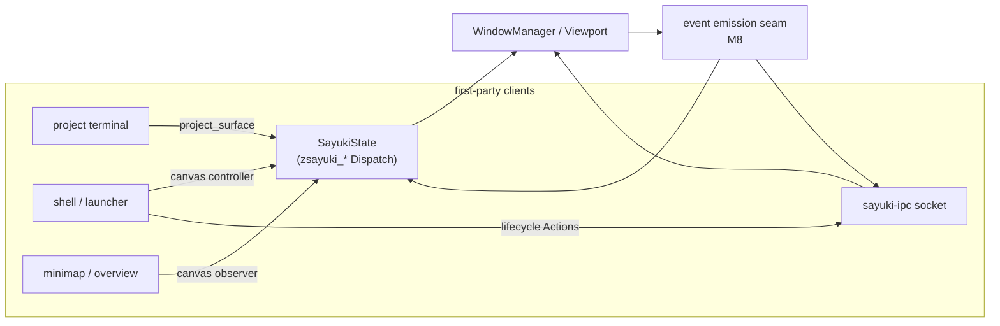

# Milestone 9 — First-party protocols (`sayuki-protocols`)

Detailed spec for roadmap milestone 9 (`docs/roadmap.md`). Adds Sayuki's own
Wayland protocol extensions for the things the **project-oriented** WM model needs
that no standard protocol expresses and the out-of-band IPC plane cannot reach:
**per-surface project affinity** and the **unbounded-canvas viewport**.

Status: planned. Builds on milestone 5 (`docs/milestone-5-window-manager-model.md`,
the canvas/viewport + project session model), milestone 6
(`docs/milestone-6-desktop-protocols.md`, security-context registration), and
milestone 7 (`docs/milestone-7-config-and-ipc.md`, the IPC control plane and event
stream).

## Guiding principle: protocol only when surface- or client-bound

Sayuki already has two interop surfaces. A third (custom Wayland protocols) is only
justified where **both** of these hold; otherwise the capability belongs in
`sayuki-ipc` (control plane) or a standard wlr/ext protocol (ecosystem interop).

1. **It is bound to `wl_surface` or `wl_client` lifecycle** — the meaning is
   "*this surface* belongs to project X", or "tear the binding down when the client
   disconnects". IPC has no handle on a `wl_surface`, so it cannot express this.
2. **No standard wlr/ext protocol already expresses it.**



The emission seam is the M8 one (events as a side effect of `SayukiState`
mutations) — `canvas` observer events and IPC events share **one** source; we do
not build a second emission path.

## Baseline (what exists today)

- `SecurityContextState::new::<Self, _>(&display_handle, |_| true)` (`state.rs:212`)
  — the sandboxed-client filter is a **stub that accepts everything**. M6 landed
  registration; *enforcement* was explicitly deferred. M9 is where it gets wired,
  because the `zsayuki_*` globals must be filtered to trusted clients.
- Hand-rolled protocol precedent: `screencopy.rs` implements
  `wlr-screencopy-unstable-v1` `GlobalDispatch`/`Dispatch` directly (Smithay 0.7
  ships no helper). The `sayuki-protocols` impls follow the same shape.
- `Viewport { loc: Point<i32, Logical>, zoom: f64 }` (`wm/viewport.rs:24`) is the
  per-output camera, with `clamp_pan`/`PAN_LIMIT` and `MIN_ZOOM`/`MAX_ZOOM`. This
  is exactly the state `zsayuki_canvas_v1` exposes and drives.
- `WindowId(u64)` (M7) already names windows across boundaries; reused here.
- Project model lives in `project.rs` / `state/project.rs`; the active project per
  canvas is the `set_project` target.

─

# The `sayuki-protocols` crate

```text
crates/sayuki-protocols/
  protocols/
    sayuki-project-v1.xml
    sayuki-canvas-v1.xml
  build.rs            # wayland-scanner: XML -> generated server bindings
  src/lib.rs          # re-export generated server module(s)
```

- `build.rs` runs `wayland-scanner` (the `wayland-scanner` crate) to emit
  server-side code; `src/lib.rs` re-exports the generated `server` module.
- The crate holds **only** the generated bindings — no compositor logic. The
  `GlobalDispatch`/`Dispatch` impls live with the compositor (a `protocols.rs`
  module, mirroring `screencopy.rs`), so they can reach `SayukiState`.
- `interface = "zsayuki_*"`, `version` starts at 1, additive evolution only.

## The trust gate (prerequisite, not optional)

Both globals are advertised **only to trusted first-party clients**. Concretely:

- Replace the `|_| true` security-context filter (`state.rs:213`) with a real
  predicate, and record per-client trust (a client that bound through a
  security-context listener / Flatpak instance is *untrusted*; a direct
  same-user connection with no sandbox context is *trusted*).
- In each `GlobalDispatch::can_view` (or by withholding the global at filter
  time), deny untrusted clients. A sandboxed app must not bind `zsayuki_project`
  or `zsayuki_canvas` — it would otherwise relocate cameras or impersonate
  project membership.
- This is the same posture as M7's "don't leak `SAYUKI_SOCKET` into sandboxes":
  privileged surface stays first-party; sandboxed clients go through the portal.

─

# `zsayuki_project_v1` — per-surface project affinity

The capability IPC fundamentally cannot provide: a client tells the compositor
"*this* toplevel belongs to project X, place it at these canvas coords" **at map
time**, race-free, instead of the compositor heuristically matching app_id/pid
after the fact.

```
interface zsayuki_project_manager_v1 (factory, global)
  request get_project_surface(new_id: zsayuki_project_surface_v1, surface: wl_surface)
      -- surface must have (or will have) an xdg_toplevel role
  request destroy()

interface zsayuki_project_surface_v1
  -- requests (client -> compositor), all before the surface's first commit:
  request set_project(name: string)               -- which canvas this window lives on
  request set_canvas_position(x: int, y: int)      -- persistent canvas coords (M5 free-float)
  request set_rule_hint(key: string, value: string)-- floating/pin/fullscreen-on-open hints
  request destroy()
  -- events (compositor -> client):
  event assigned(project_name: string)             -- authoritative project it landed on
  event canvas_position(x: int, y: int)            -- authoritative coords after placement
```

Design constraints:

- **Commit ordering.** Like an xdg role, the affinity must be declared before the
  surface maps. `set_project`/`set_canvas_position` after the first commit is a
  `protocol_error` (`already_mapped`). The compositor reads the pending project
  state when promoting the toplevel in `add_toplevel` and places it on the named
  canvas at the requested coords (clamped via `clamp_pan`), instead of the default
  staggered placement.
- **Unknown project.** `set_project` with a name that has no open/known project →
  `assigned` carries the *fallback* canvas name (current project), not an error;
  the client learns where it actually went. (A strict mode could error; v1 is
  lenient so spawn ordering is forgiving.)
- **One object per surface.** Second `get_project_surface` on the same surface →
  `protocol_error`.
- **Lifecycle.** The object is destroyed with the surface; affinity is not
  retroactively re-applied on later commits.

Payoff: a terminal spawned by a `.sayuki` `on_init` hook (M5) declares its own
project membership, so it lands on the right canvas deterministically — closing
the gap M7 left where placement of externally-spawned windows was heuristic.

─

# `zsayuki_canvas_v1` — the unbounded-canvas viewport

No standard protocol models a camera over an unbounded canvas (the defining M5
mechanic). Two roles share one factory, scoped per `wl_output`.

```
interface zsayuki_canvas_manager_v1 (factory, global)
  request get_canvas(new_id: zsayuki_canvas_v1, output: wl_output)
  request destroy()

interface zsayuki_canvas_v1
  -- OBSERVER events (compositor -> client), for minimap / overview:
  event viewport(x: int, y: int, zoom: fixed)      -- camera loc + zoom for this output
  event window_geometry(id: uint, x: int, y: int, w: int, h: int, focused: uint)
  event window_removed(id: uint)
  event project_changed(name: string)             -- canvas swapped on this output
  event done()                                     -- atomic batch boundary (wl_output style)
  -- CONTROLLER requests (client -> compositor), for the shell:
  request pan(x: int, y: int)                      -- absolute canvas coord at top-left
  request pan_by(dx: int, dy: int)
  request zoom(factor: fixed)                       -- clamped to MIN_ZOOM..MAX_ZOOM
  request focus_window(id: uint)                    -- reveal-on-focus pan to a window
  request overview(enable: uint)                    -- fit-all toggle
  request destroy()
```

Design constraints:

- **Single source of truth.** Observer events are emitted from the same
  `SayukiState` mutation seam as the M8 IPC event stream — extend that seam to also
  push to bound `zsayuki_canvas` objects; do not add a parallel emit path. A
  `WindowChanged`/viewport-pan mutation fans out to IPC subscribers *and* canvas
  observers from one place.
- **Batching.** Coalesce a burst (e.g. a pan that re-reports many windows) and
  terminate with `done()`, so a minimap repaints once per logical update — mirrors
  `wl_output`'s atomic-config pattern.
- **Controller writes go through `Action`/the WM, not a side door.** `pan`/`zoom`/
  `focus_window`/`overview` map onto the same internal viewport operations
  keybindings and IPC already drive (`wm/viewport.rs`), so there is still one
  dispatch path; the protocol is just a third caller. `zoom` is clamped exactly
  like the existing path.
- **Per-output.** Each object is bound to one `wl_output`; multi-monitor minimaps
  bind several. Camera linking (M5 "linked viewports") is reported as-is.

v1 scope is **state-out + drive-camera**. A minimap surface that wants to *render
frame-synced to the camera serial* (so its content never tears against a live pan)
is a real follow-up but separable — documented as a gap, the way M8 documented
incremental screencopy.

─

# What stays out of `sayuki-protocols`

Pushed to `sayuki-ipc` (`Action`/`Request`) — no surface binding, so no protocol:

- **Project lifecycle**: create / switch / close projects, apply a layout, run
  hooks. The shell launcher drives these over the socket (`Action::ProjectOpen`,
  `SwitchWorkspace`, etc. already exist in M7) and uses `canvas` controller only
  for the camera move that accompanies a switch.
- **Bulk window/project queries**: `GetWindows`/`GetProjects` already serve panels.

Pushed to standard protocols (ecosystem interop):

- **External window control** → `wlr-foreign-toplevel-management` (M8 open item),
  so third-party tools work without speaking `zsayuki_*`.

─

## Touched symbols (M9)

- New crate `crates/sayuki-protocols` (XML + `build.rs` + generated re-exports);
  add to workspace `Cargo.toml`; add `wayland-scanner` build-dep.
- New compositor module `protocols.rs`: `GlobalDispatch`/`Dispatch` for the four
  interfaces; `delegate_*`-style wiring into `SayukiState` (follow `screencopy.rs`).
- `state.rs`: replace the `|_| true` security-context filter (`:213`) with a real
  trust predicate; store per-client trust; advertise `zsayuki_*` globals filtered
  by it. Pending project-affinity state read in `add_toplevel` (`:327`).
- `wm/viewport.rs` / the viewport dispatch path: expose `pan`/`zoom`/`focus`/
  `overview` entry points reused by the canvas controller.
- The M8 event-emission seam: fan observer events out to bound `zsayuki_canvas`
  objects alongside IPC subscribers.

## Acceptance (M9)

- A test client binds `zsayuki_project_manager`, creates a toplevel with
  `set_project("blog")` + `set_canvas_position(2000, 0)` before commit, and the
  window maps on the `blog` canvas at those coords — not the staggered default;
  the client receives `assigned("blog")` + `canvas_position(2000, 0)`.
- `set_project` after first commit yields `protocol_error`.
- A `zsayuki_canvas` observer receives a `viewport` + `window_geometry…done` batch
  on connect and an updated batch within one frame of a pan; a controller
  `pan`/`zoom` moves the camera identically to the matching keybinding.
- A **sandboxed** client (registered via security-context) cannot bind either
  global.
- A `.sayuki` `on_init`-spawned terminal that speaks `zsayuki_project` lands on the
  correct canvas deterministically across repeated launches.

## Testing strategy

- Generated-binding smoke: the crate builds and the four interfaces are present.
- Protocol logic is exercised with a headless test client against the nested
  backend (the screencopy + `grim` verification pattern from M8): affinity
  placement, commit-ordering error, canvas observer batches, controller parity
  with keybindings, and the trust-gate denial for a sandboxed client.
- Pure viewport maths stays unit-tested in `wm/viewport.rs` (already is).

## Decisions

| Fork | Choice | Why |
|---|---|---|
| Project↔surface binding | custom Wayland protocol (`zsayuki_project`) | Race-free, applies at map time, lifecycle-correct; IPC cannot reference a `wl_surface` |
| Canvas/viewport interop | custom Wayland protocol (`zsayuki_canvas`) | No standard models an unbounded canvas; observer + controller in one |
| Project lifecycle | `sayuki-ipc` `Action`/`Request` | No surface binding → control plane, not a protocol |
| External window control | standard `wlr-foreign-toplevel-management` (M8) | Third-party tools without being first-party |
| Access control | security-context trust gate | Privileged surface stays first-party; sandboxes use the portal |
| Event emission | extend the M8 seam (one source) | No divergent emit paths for IPC vs canvas observers |

## Deferred

- Frame-synced minimap rendering (camera serial → surface commit fence).
- Incremental `window_geometry` diffs (v1 re-reports the visible set per batch).
- A strict `set_project` mode that errors on unknown project names.
- Cross-protocol object references (e.g. a `project_surface` handle inside a
  `canvas` event) — keep `WindowId` as the shared name for now.

## Crate plan impact

Lands `sayuki-protocols`, previously listed as a *possible later* crate — now
**committed**. It holds generated bindings only; protocol handlers live with the
compositor / `sayuki-core`. No change to the other planned crates.
